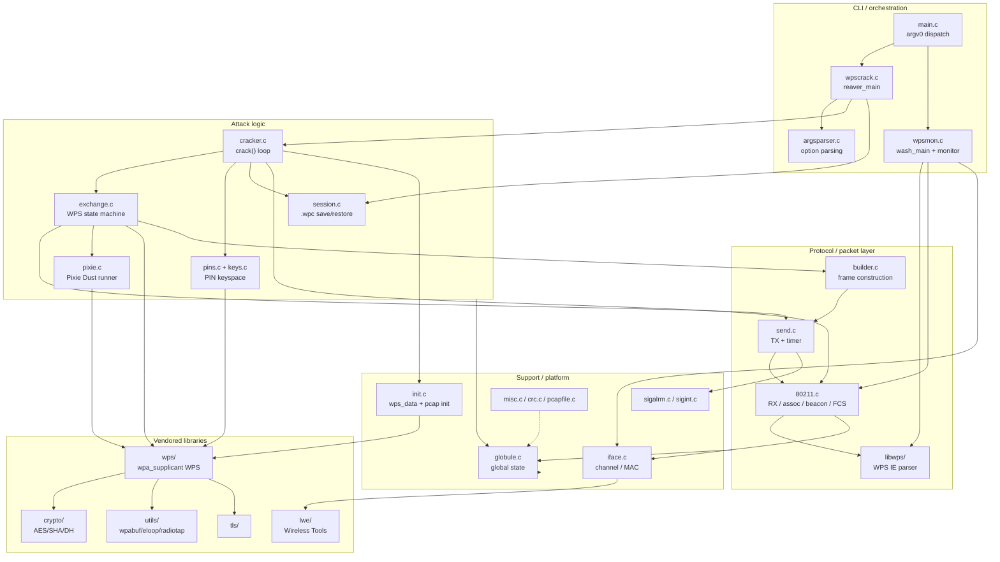

# Architecture

This document describes the high-level structure of the code: the two programs,
the layers they are built from, and how a request flows through the modules.

## 1. One binary, two programs

The build produces a single executable `reaver`; `wash` is a symlink to it
(`Makefile:119`). At startup, `main()` looks at the basename of `argv[0]` and
dispatches accordingly:

```c
// main.c:9
int main(int argc, char** argv) {
    char *e = strrchr(argv[0], '/');
    ...
    if(!strcmp(e, "wash")) command = C_WASH;
    ...
    if(command == C_WASH) return wash_main(argc, argv);
    else                  return reaver_main(argc, argv);
}
```

- `reaver_main` → `wpscrack.c:40`
- `wash_main` → `wpsmon.c:155`

Both share the same support libraries (global state, 802.11 layer, libwps,
vendored crypto/WPS). Only the top-level orchestration differs.

## 2. Layered view

From the highest level (CLI) down to the wire:



## 3. Module responsibilities

### CLI / orchestration
| File | Responsibility |
|------|----------------|
| `main.c` | Selects `reaver` vs `wash` by `argv[0]` (`main.c:9`). |
| `wpscrack.c` | `reaver_main`: init, parse args, sanity checks, run `crack()`, print result, run `-C` exec command, save session. |
| `wpsmon.c` | `wash_main`: parse args, open each capture source, run `monitor()`; plus `parse_wps_settings()` and probe sending. |
| `argsparser.c` | `process_arguments()` for reaver; `init_default_settings()`, `parse_static_pin()`, `parse_recurring_delay()`, `is_valid_pin()`. |

### Attack logic
| File | Responsibility |
|------|----------------|
| `cracker.c` | `crack()` main loop (`cracker.c:87`): delays, lock detection, per-pin reassociate + exchange, status/progress, MAC changer. |
| `exchange.c` | `do_wps_exchange()` (`exchange.c:37`): the EAP/WPS state machine; `process_packet()` / `process_wps_message()` parse RX. |
| `pins.c` + `keys.c` | Build the next PIN from the `p1`/`p2` index arrays; `keys.c` holds the static candidate tables. |
| `pixie.c` | Spawn `pixiewps` with the collected DH/hash values; set the recovered PIN. |
| `session.c` | `.wpc` session persistence, crack progress, and PIN "jump-queue" reordering. |

### Protocol / packet layer
| File | Responsibility |
|------|----------------|
| `builder.c` | Construct radiotap, 802.11, LLC/SNAP, 802.1X, EAP, and WFA headers and full frames. |
| `send.c` | `send_packet()` via `pcap_inject`, remember last packet for resend, arm receive timer. |
| `80211.c` | `next_packet()`/`next_beacon()`, `reassociate()` (deauth→auth→assoc), beacon tag parsing, FCS validation, radiotap field extraction. |
| `libwps/` | Standalone WPS information-element parser used by wash (`parse_wps_parameters`, `wps_data_to_json`). |

### Support / platform
| File | Responsibility |
|------|----------------|
| `globule.c/.h` | The single global `struct globals *globule` and ~70 typed getters/setters. |
| `iface.c` | `read_iface_mac()`, `next_channel()`, `change_channel()` (wext / libnl3 / Apple variants). |
| `init.c` | `initialize_wps_data()` (builds wpa_supplicant `wps_data`), `capture_init()` (pcap setup). |
| `sigalrm.c` | Receive-timeout timer that also resends the last packet; `start_timer()`/`stop_timer()`. |
| `sigint.c` | Ctrl-C handler: terminate WPS session, save session, clean up. |
| `misc.c` | `mac2str`/`str2mac`, `cprintf` (leveled logging), `pcap_sleep`. |
| `crc.c` | CRC-32 used for 802.11 FCS checking. |
| `pcapfile.c` | Minimal pcap file writer for the `-O` output option. |
| `version.c` | `get_version()` returning the generated `R_VERSION`. |

### Vendored libraries
See [11-vendored-code.md](11-vendored-code.md). In short: `wps/` is the
wpa_supplicant WPS implementation (patched to feed Pixie Dust), `crypto/` and
`tls/` provide the cryptographic primitives, `utils/` provides `wpabuf`,
`eloop`, radiotap parsing, UUID and vendor-OUI helpers, and `lwe/` is Wireless
Tools v29 used for wext channel switching.

## 4. The global-state pattern

Almost all cross-module state lives in one heap-allocated struct,
`struct globals *globule` (`globule.h:39`, allocated in `globule_init()`
`globule.c:38`). Modules never touch its fields directly; they call typed
accessors such as `get_bssid()`, `set_key_status()`, `get_wps()`. This keeps the
many small `.c` files decoupled while sharing the pcap handle, target BSSID/MAC,
the WPS data structure, PIN arrays, timeouts, and flags.

The notable exception is the **Pixie Dust** path, which uses its own global
`struct pixie pixie` (`pixie.h:9`, defined `pixie.c:24`) because the values are
collected deep inside the vendored `wps/` code.

See [09-state-and-session.md](09-state-and-session.md) for the full field list.

## 5. Two end-to-end flows

**Reaver (online brute force):**

```
main → reaver_main → process_arguments → crack()
  └─ loop: pcap_sleep → check lock (beacon) → initialize_wps_data
           → build_next_pin → reassociate → do_wps_exchange
              └─ EAPOL-Start → ID req/resp → M1..M8 (NACK = wrong half)
           → advance_pin_count / KEY_DONE → save_session/display_status
```

**Wash (scan):**

```
main → wash_main → (per source) capture_init → monitor()
  └─ loop: next_packet → parse_wps_settings
              └─ beacon/probe-resp → parse_beacon_tags + parse_wps_parameters
                 → dedup (seen_list) → print row or JSON; optionally send probe
```

Each flow is detailed in [03-reaver-attack-flow.md](03-reaver-attack-flow.md)
and [08-wash-scanner.md](08-wash-scanner.md).
