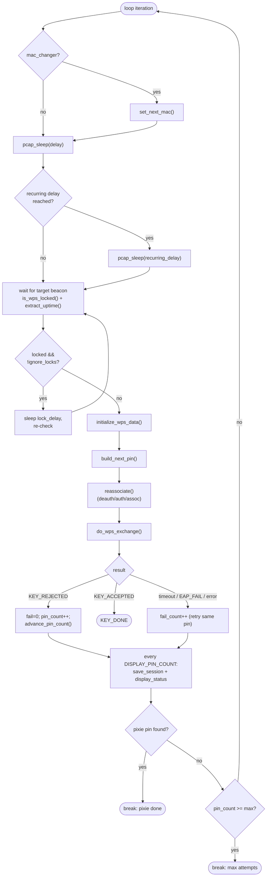
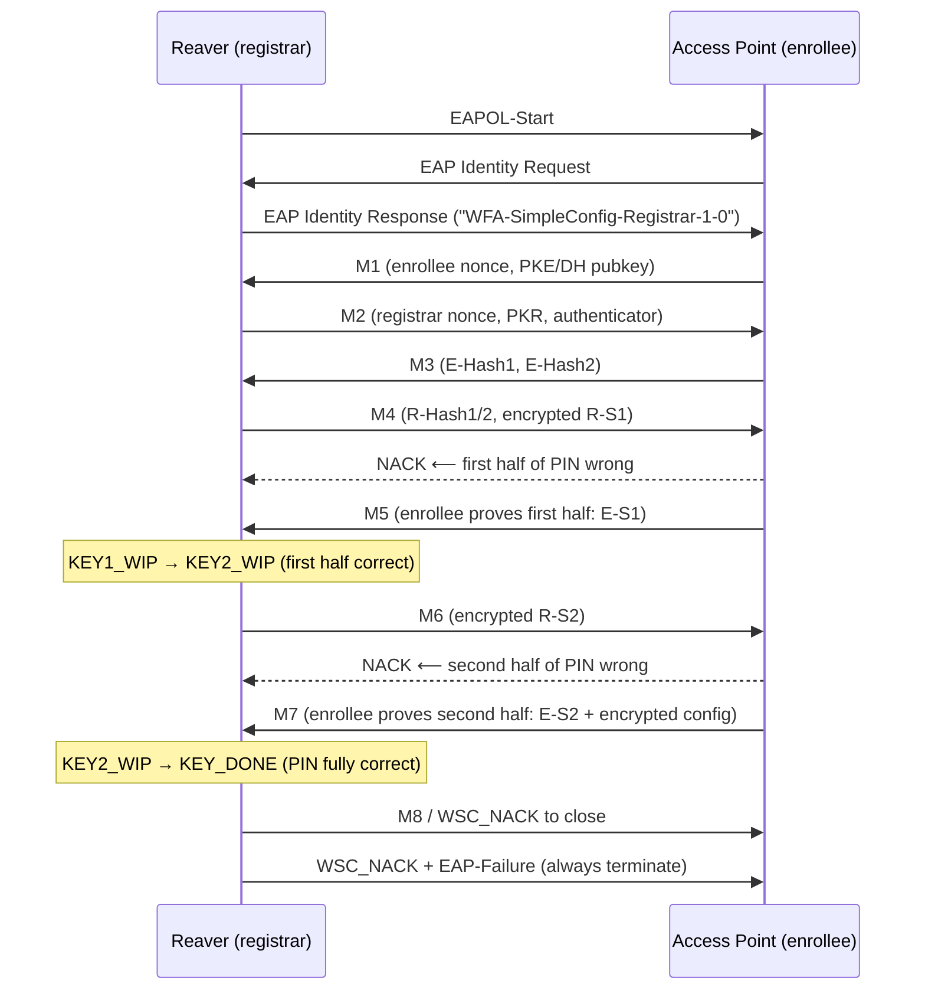

# Reaver Attack Flow (Online Brute Force)

This is the core of `reaver`: associate with the target AP as a WPS *registrar*
and run the WPS exchange once per candidate PIN. The protocol reveals whether
the **first half** and **second half** of the PIN are correct independently,
which is what makes the attack tractable
(see [05-pin-keyspace.md](05-pin-keyspace.md)).

## 1. Entry: `reaver_main`

Source: `wpscrack.c:40`.

1. `globule_init()` + `init_default_settings()` — allocate global state and set
   defaults (`argsparser.c:223`).
2. Print banner with `get_version()`.
3. `process_arguments()` — parse CLI (`argsparser.c:46`).
4. Validate: an interface **and** a non-null BSSID are required
   (`wpscrack.c:66`).
5. If no `-m` MAC was given, read the interface MAC via `read_iface_mac()`
   (`wpscrack.c:73`).
6. Clamp the M5/M7 timeout and RX timeout to sane ranges
   (`wpscrack.c:83-96`).
7. Install signal handlers: `sigint_init()` (Ctrl-C) and `sigalrm_init()`
   (receive timer) (`wpscrack.c:99`).
8. Run `crack()` and time it.
9. On `KEY_DONE`: print the PIN (`get_pin()`), and the WPA PSK / SSID from the
   `wps_data` structure; optionally run the `-C` command via `system()`
   (`wpscrack.c:112-128`).
10. `save_session()` and `globule_deinit()`.

## 2. The `crack()` loop

Source: `cracker.c:87`.

Setup before the loop:
- Reject blacklisted devices (`get_max_pin_attempts() == -1`)
  (`cracker.c:101`).
- `capture_init()` opens the interface in monitor mode (`cracker.c:108`,
  see `init.c:119`).
- `generate_pins()` fills the `p1`/`p2` candidate arrays (`cracker.c:114`,
  `pins.c:101`).
- `restore_session()` may resume a prior `.wpc` (`cracker.c:120`).
- `read_ap_beacon()` waits for a beacon to learn capabilities, SSID, channel,
  and vendor (`cracker.c:131`, `80211.c:151`).
- Normalize `key_status` so the loop enters at `KEY1_WIP` (or `KEY2_WIP` if the
  PIN was already found and we are re-attacking) (`cracker.c:162-174`).

Each iteration (`cracker.c:177`):

Key points:
- **Lock detection** reuses the beacon it must wait for anyway; the same beacon
  updates the router uptime used by Pixie Dust (`cracker.c:208-216`).
- A **fresh `wps_data`** is created per attempt and freed afterward unless the
  key was found (`cracker.c:228`, `cracker.c:315`).
- **Reassociation per attempt** is required because many APs throttle PIN
  attempts otherwise (`cracker.c:251`).
- After 10 consecutive failures (`WARN_FAILURE_COUNT`) it warns and sleeps
  `fail_delay` (`cracker.c:295`).

`advance_pin_count()` (`cracker.c:359`) increments `p1_index` while
`KEY1_WIP`, otherwise `p2_index`.

## 3. The WPS exchange state machine

Source: `do_wps_exchange()` (`exchange.c:37`). This is one full WPS registration
attempt for the current PIN.

It begins by sending an **EAPOL-Start** (`send_eapol_start()`, `send.c:37`) and
then loops, reading packets with `next_packet()` and classifying them with
`process_packet()` (`exchange.c:345`). Based on the received WPS message type it
decides what to transmit next.

### Message handling (the switch in `exchange.c:82`)

| Received | Action | State effect |
|----------|--------|--------------|
| Identity Request | send Identity Response (`SEND_M2` path armed) | `id_response_sent=1` |
| `M1` | if id-response already sent and M2 not yet sent → send `M2` | `m2_sent=1` |
| `M3` | if M2 sent and M4 not yet sent → send `M4` | `m4_sent=1` |
| `M5` | first half correct → `KEY1_WIP`→`KEY2_WIP`; send `M6` | `KEY2_WIP` |
| `M7` / `DONE` | second half correct → `KEY_DONE`; send `WSC_NACK` | `KEY_DONE` |
| `NACK` | record `got_nack`; loop ends | (analyzed below) |
| `TERMINATE` (EAP-Failure) | `terminated=1` | retry pin |
| `WPS_PT_DEAUTH` | note deauth, keep waiting | — |
| unexpected | `terminated=1` | retry pin |

`-N`/`--no-nacks` (`get_oo_send_nack()`) controls whether out-of-order messages
are answered with a NACK or simply waited on (`exchange.c:101`, etc.).
`-6`/`--repeat-m6` (`get_repeat_m6()`) re-sends M6 on duplicated M5
(`exchange.c:130`).

### Interpreting the outcome (`exchange.c:213`)

There are four ways a PIN attempt fails, and the code distinguishes them:

| Condition | `last_msg` | Meaning | Return |
|-----------|-----------|---------|--------|
| NACK after M3 | `M3` | first half wrong | `KEY_REJECTED` |
| NACK after M5 | `M5` | second half wrong | `KEY_REJECTED` |
| Timeout waiting for M5/M7 (if `-J`) | `M3`/`M5` | half wrong | `KEY_REJECTED` |
| Other timeout | — | transient | `RX_TIMEOUT` (retry) |
| EAP-Failure without NACK | — | transient | `EAP_FAIL` (retry) |

Special cases:
- A NACK with reason `MESSAGE_TIMEOUT` is treated as a **fake NACK** warning
  (`exchange.c:236`).
- A NACK with reason `SETUP_LOCKED` right after `M1` means **WPS is locked**; the
  attack quits unless `-L`/`--ignore-locks` is set (`exchange.c:252`).
- Receiving a real NACK proves the AP sends NACKs, so timeout-as-NACK is turned
  off to avoid false negatives (`exchange.c:231`).

The session is **always terminated** with `send_wsc_nack()` (and an EAP-Failure
when `-E`/`--eap-terminate` is set or on `EAP_FAIL`) so the AP's WPS state
machine does not get stuck (`exchange.c:298-312`).

## 4. RX parsing: `process_packet`

Source: `exchange.c:345`. Walks the encapsulation layers, returning early
(`UNKNOWN`) on any mismatch:

1. Skip the radiotap header using its own length field (`exchange.c:367`).
2. 802.11 header: require `addr3 == BSSID` and `addr1 == our MAC`
   (`exchange.c:373`, `exchange.c:377`).
3. Detect deauth (`exchange.c:380`).
4. Require a data frame (handles QoS by skipping 2 extra bytes)
   (`exchange.c:386`).
5. LLC/SNAP must be `DOT1X_AUTHENTICATION` (0x888E) (`exchange.c:396`).
6. 802.1X must carry an EAP packet (`exchange.c:404`).
7. EAP: `EAP_FAILURE` → `TERMINATE`; `EAP_REQUEST` of type `EAP_IDENTITY` →
   `IDENTITY_REQUEST` (`exchange.c:412-432`).
8. Expanded EAP with WFA type `SIMPLE_CONFIG` → it's a WPS message; hand the
   payload to `process_wps_message()` (`exchange.c:435-459`).

Receiving any valid EAP packet **stops the receive timer** (`exchange.c:423`),
and the EAP id is saved for building responses (`exchange.c:420`).

`process_wps_message()` (`exchange.c:463`) feeds the buffer to
`wps_registrar_process_msg()` (vendored), then scans the WFA elements to find
the `MESSAGE_TYPE` (returned as the `enum wps_type`) and any
`CONFIGURATION_ERROR` (stored as the NACK reason).

## 5. The receive timer (resend + timeout)

Source: `sigalrm.c`. Every transmitted packet arms a timer via `start_timer()`
(called from `send_packet`, `send.c:181`).

- `start_timer()` (`sigalrm.c:70`) chooses the timeout:
  - For M5/M7 when timeout-is-NACK is enabled, the short `m57_timeout`
    (default 400 ms, `M57_DEFAULT_TIMEOUT`).
  - Otherwise `rx_timeout` seconds (default 10 s).
- The timer fires every `resend_timeout_usec` (200 ms,
  `globule.c:47`). On each tick `alarm_handler()` (`sigalrm.c:109`):
  - If total elapsed exceeds the timeout → set `out_of_time` (the exchange loop
    notices and treats it appropriately).
  - Else **resend the last packet** (`resend_last_packet()`, `send.c:160`) and
    rewind the timer. This gives automatic retransmission for lost frames.
- Any valid EAP RX calls `stop_timer()` (`exchange.c:423`).

This timer machinery is why the binary links `-lrt` (POSIX `timer_settime`).

## 6. Reassociation

Before each exchange, `reassociate()` (`80211.c:323`) runs a small state machine:
`deauthenticate()` → `authenticate()` → wait for auth resp → `associate()` →
wait for assoc resp. With `-A`/`--no-associate`
(`get_external_association()`), it returns success immediately and assumes an
external tool manages association (`80211.c:325`). Details of the frames are in
[04-packet-layer.md](04-packet-layer.md).

## 7. CLI options that shape this flow

| Option | Effect on the flow |
|--------|--------------------|
| `-d, --delay` | Sleep between attempts (`pcap_sleep`, `cracker.c:188`). |
| `-r, --recurring-delay x:y` | Sleep `y` s every `x` attempts (`cracker.c:191`). |
| `-l, --lock-delay` | Wait when AP reports WPS locked (`cracker.c:217`). |
| `-L, --ignore-locks` | Ignore the locked state (`cracker.c:216`, `exchange.c:255`). |
| `-t, --timeout` | RX timeout seconds (`sigalrm.c:92`). |
| `-T, --m57-timeout` | Short M5/M7 timeout (`sigalrm.c:86`). |
| `-J, --timeout-is-nack` | Treat M5/M7 timeouts as NACKs (DIR-300/320) (`exchange.c:269`). |
| `-N, --no-nacks` | Don't NACK out-of-order packets (`exchange.c:101`). |
| `-E, --eap-terminate` | End each session with EAP-Failure (`exchange.c:308`). |
| `-g, --max-attempts` | Quit after N attempts (`cracker.c:339`). |
| `-x, --fail-wait` | Sleep after 10 consecutive failures (`cracker.c:299`). |
| `-M, --mac-changer` | Change last MAC bytes each attempt (`cracker.c:180`). |
| `-w, --win7` | Mimic a Windows 7 registrar (`init.c:101`). |
| `-S, --dh-small` | Use small DH keys (`init.c`/vendored, [07-crypto-keys.md](07-crypto-keys.md)). |
| `-A, --no-associate` | Skip internal association (`80211.c:325`). |
| `-K`/`-Z` | Pixie Dust mode ([06-pixie-dust.md](06-pixie-dust.md)). |
