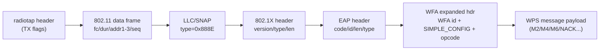

# Packet Layer

Everything Reaver/wash send and receive is a raw 802.11 frame. This layer turns
high-level intent ("send M2", "associate") into bytes on the wire, and parses
incoming frames back into structured data.

Relevant files: `builder.c` (construction), `send.c` (TX + timer), `80211.c`
(RX, association, beacon parsing, FCS), `crc.c` (CRC-32), `pcapfile.c` (`-O`
output). Packed wire structs live in `defs.h` (see
[12-reference.md](12-reference.md)).

## 1. Frame encapsulation

A WPS EAP message that Reaver injects is layered like this:



Byte layout on air (radiotap is stripped by the parser using its own length
field; the FCS is appended by the radio):

```
+----------+-------------+----------+--------+-----+-----+---------+------+
| radiotap | 802.11 hdr  | LLC/SNAP | 802.1X | EAP | WFA | payload | FCS  |
| (var)    | 24 bytes    | 8 bytes  | 4 by.  | 5 b | 8 b | (var)   | 4 by |
+----------+-------------+----------+--------+-----+-----+---------+------+
```

Not every frame has all layers: an **EAPOL-Start** is radiotap + 802.11 +
LLC/SNAP + 802.1X(Start) with no EAP (`builder.c:284`). Management frames
(auth/assoc/deauth/probe) are radiotap + 802.11 + a management body, with no
LLC.

## 2. Construction — `builder.c`

| Function | Builds | Source |
|----------|--------|--------|
| `build_radio_tap_header` | A fixed radiotap header with TX flags `NOACK\|NOSEQ`. Optionally includes a rate field (`RADIOTAP_HEADER_WITH_RATE`). | `builder.c:37` |
| `build_dot11_frame_header` | 802.11 header to the BSSID; sets duration 52, increments a static sequence by 0x10. | `builder.c:82` |
| `build_dot11_frame_header_broadcast` | Same but to `ff:ff:ff:ff:ff:ff`. | `builder.c:86` |
| `build_authentication_management_frame` | Open-system auth, sequence 1. | `builder.c:90` |
| `build_association_management_frame` | Capability (from AP) + listen interval. | `builder.c:99` |
| `build_llc_header` | LLC/SNAP with ethertype `0x888E` (802.1X). | `builder.c:107` |
| `build_wps_probe_request` | A directed or broadcast probe with SSID, rates, HT caps, and a WPS probe IE. | `builder.c:120` |
| `build_snap_packet` | Wrapper: radiotap + 802.11 + LLC. | `builder.c:192` |
| `build_dot1X_header` | 802.1X header (version/type/len). | `builder.c:220` |
| `build_eap_header` | EAP header (code/id/len/type). | `builder.c:240` |
| `build_wfa_header` | WFA expanded header (vendor id + `SIMPLE_CONFIG` + opcode). | `builder.c:263` |
| `build_eapol_start_packet` | SNAP + 802.1X-Start. | `builder.c:284` |
| `build_eap_packet` | SNAP + 802.1X + EAP (+ WFA for expanded) + payload — the workhorse for WPS messages. | `builder.c:316` |
| `build_eap_failure_packet` | SNAP + 802.1X + EAP-Failure. | `builder.c:391` |
| `build_ssid_tagged_parameter` | SSID IE. | `builder.c:435` |
| `build_wps_tagged_parameter` | The registrar WPS IE used in association. | `builder.c:449` |
| `build_supported_rates_tagged_parameter` | Supported + extended rates (replays the AP's, clearing the basic-rate bit). | `builder.c:464` |
| `build_htcaps_parameter` | Replays the AP's HT capabilities IE. | `builder.c:498` |

`build_eap_packet` decides EAP code/type from the current `wps->state`: in the
`RECV_M1` state it builds an EAP-Response/Identity, otherwise an
EAP-Response/Expanded with a WFA header (`builder.c:324-345`).

The probe request embeds hard-coded rate/HT-caps tags plus a minimal WPS probe
IE (`builder.c:154-164`). The directed-vs-broadcast tradeoff (stealth) is noted
in a comment at `builder.c:122`.

## 3. Transmission — `send.c`

- `send_packet(...)` is a macro wrapper around `send_packet_internal()`
  (`send.h`) that records the caller for debug logging, then calls
  `send_packet_real()` (`send.c:168`):
  - `pcap_inject()` writes the frame (`send.c:171`).
  - If `use_timer`, the frame is copied into `last_packet[4096]` and
    `start_timer()` is armed (`send.c:176`). This pairing guarantees the
    receive timer always starts right after a TX.
- `resend_last_packet()` re-injects `last_packet` without re-arming (used by the
  timer's resend logic) (`send.c:160`).
- High-level senders: `send_eapol_start()` (`send.c:37`),
  `send_identity_response()` (`send.c:68`), `send_msg(type)` (`send.c:89`,
  pulls the next WPS message from `wps_registrar_get_msg`),
  `send_wsc_nack()` (`send.c:148`), `send_termination()` (`send.c:134`).

## 4. Reception — `80211.c`

### Reading frames
- `next_packet()` (`80211.c:56`) loops `pcap_next_ex()`, skipping pcap
  timeouts. For every packet it optionally writes to the `-O` pcap file
  (`pcapfile_write_packet`) and, when FCS validation is on, drops frames with a
  bad checksum (`80211.c:74`).
- `is_management_frame()` (`80211.c:94`) returns `1` for beacons, `-1` for probe
  responses, and fills frame-header/management-frame pointers.
- `next_management_frame()` / `next_beacon()` (`80211.c:122`, `80211.c:134`)
  filter the stream to the frame kinds the callers need.

### Beacon handling
- `read_ap_beacon()` (`80211.c:151`) blocks until a beacon from the target is
  seen, recording the capability field and calling `parse_beacon_tags()`. If no
  beacon arrives within `BEACON_WAIT_TIME` it hops channels.
- `parse_beacon_tags()` (`80211.c:536`) extracts, from the IE/tag area: the SSID
  (if not user-specified), HT caps, supported + extended rates, the channel (tag
  3), and the chipset **vendor OUI** (heuristic scan for a vendor-specific tag,
  `80211.c:605-617`). These feed association frames and the vendor display.
- `parse_ie_data()` (`80211.c:624`) is the generic tag walker returning a copy of
  a requested IE's data.

### Association
`reassociate()` (`80211.c:323`) drives `deauthenticate()` (`80211.c:361`),
`authenticate()` (`80211.c:384`), and `associate()` (`80211.c:416`).
`associate()` assembles radiotap + 802.11 + assoc-request + SSID + supported
rates + (HT caps) + WPS IE (`80211.c:431-462`).
`process_authenticate_associate_resp()` (`80211.c:265`) waits (under the receive
timer) for a matching auth or assoc response with a success status.

### Radiotap helpers
- `has_rt_header()` (`80211.c:725`) asks the pcap datalink whether radiotap is
  present (`DLT_IEEE802_11_RADIO`).
- `radio_header()` (`80211.c:742`) returns the real radiotap header or a zeroed
  fake one so downstream offset math is uniform.
- `get_radiotap_flag()` (`80211.c:205`) uses the vendored radiotap iterator
  (`utils/radiotap.c`, `radiotap_flags.h`) to pull individual fields:
  `rt_channel_freq()` (`80211.c:226`) and `signal_strength()` (`80211.c:240`).
- `freq_to_chan()` (`80211.c:187`) maps a frequency to a channel number (2.4 GHz,
  4.9/5 GHz, 60 GHz ranges).

## 5. FCS / CRC-32

- `check_fcs()` (`80211.c:660`) validates the 4-byte trailing FCS, but only when
  radiotap advertises it:
  - If `IEEE80211_RADIOTAP_F_BADFCS` is set → reject.
  - If `IEEE80211_RADIOTAP_F_FCS` is not set → accept (no FCS present).
  - Otherwise compute `~crc32(frame_after_radiotap, len-4)` and compare.
- `crc32()` (`crc.c:146`) is the standard table-driven CRC-32
  (polynomial `0xedb88320`), seeded with `0xFFFFFFFF`. The 256-entry table is at
  `crc.c:98`.
- FCS checking is controlled by `-F`/`--ignore-fcs` (`get_validate_fcs()`),
  useful on adapters that report spurious FCS errors.

## 6. pcap output (`-O`)

`pcapfile.c` is a tiny pcap (not pcapng) writer:
- `pcapfile_write_header()` (`pcapfile.c:25`) writes a 24-byte global header with
  link type `0x7F` (radiotap), choosing big/little-endian magic based on host
  endianness.
- `pcapfile_write_packet()` (`pcapfile.c:30`) writes a per-packet header
  (timestamp, caplen, len) then the raw bytes.
- The output fd is opened in the arg parser (`argsparser.c:100`,
  `wpsmon.c:213`) and the header is written when the fd is set
  (`globule.c:661`). Every `next_packet()` mirrors captured frames to it.

## 7. Endianness

Wire fields use explicit byte-order helpers from `utils/endianness.h`
(`end_htole16`, `end_htobe16`, `end_le16toh`, `end_be32toh`, `end_htobe32`,
`end_le64toh`, …). 802.11 fields are little-endian; LLC ethertype and the WFA
`SIMPLE_CONFIG` type are big-endian. The packed structs in `defs.h` use
`#pragma pack(1)` so they map directly onto the bytes.
