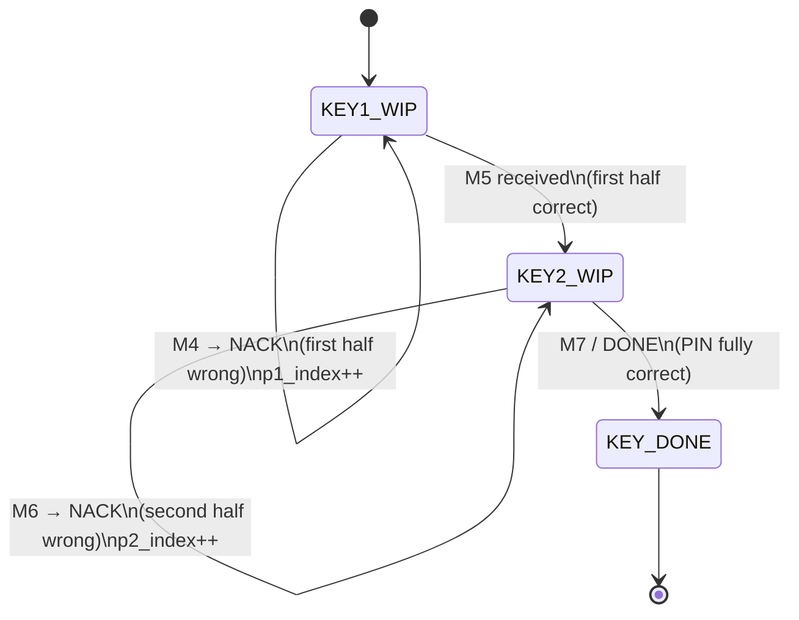

# PIN Generation & Keyspace

This explains why the WPS PIN brute force is feasible, how Reaver splits and
walks the keyspace, and how a user-supplied PIN is injected.

Relevant files: `pins.c` (assembly), `keys.c` (candidate tables),
`globule.c` (the `p1`/`p2` arrays + indices), `session.c` (jump-queue),
`argsparser.c` (`-p` parsing).

## 1. Why the keyspace collapses

A WPS PIN is 8 digits, but the 8th digit is a **checksum** of the first 7, so
there are only 10^7 = 10,000,000 valid PINs. The protocol then leaks the two
halves independently:

- **M4/NACK** tells you whether the **first 4 digits** (PSK1) are correct.
- **M6/NACK** tells you whether the **last 3 digits + checksum** (PSK2) are
  correct.

So instead of 10^7 guesses you need at most:

```
first half  : 10^4 = 10000   candidates  (P1_SIZE)
second half : 10^3 = 1000     candidates  (P2_SIZE)  ← 8th digit is derived
total       : 10000 + 1000   = 11000      attempts (worst case)
```

These sizes are the compile-time constants `P1_SIZE` (10000) and `P2_SIZE`
(1000) in `defs.h:76`.

## 2. Data structures

In `struct globals` (`globule.h`):

| Field | Meaning |
|-------|---------|
| `char *p1[P1_SIZE]` | All first-half candidates ("0000".."9999"), in attack order. |
| `char *p2[P2_SIZE]` | All second-half candidates ("000".."999"), in attack order. |
| `int p1_index` | Current position in `p1`. |
| `int p2_index` | Current position in `p2`. |
| `enum key_state key_status` | `KEY1_WIP` → `KEY2_WIP` → `KEY_DONE`. |

The candidate strings come from `keys.c`, which defines two static tables of
`struct key { char *key; int priority; }`:

```c
// keys.c:38
struct key k1[P1_SIZE] = { { "1234", 1 }, { "0000", 1 }, { "0001", 0 }, ... };
struct key k2[P2_SIZE] = { ... };
```

`keys.c` is ~11,000 lines: it is just these two literal tables. A `priority`
of 1 marks PINs that are commonly used and should be tried first (e.g. `1234`,
`0000`, `0123`, `1111`).

## 3. Building the attack order — `generate_pins()`

Source: `pins.c:101`. Called once at the start of `crack()`.

1. Copy every `k1` entry with `priority == 1` into `p1` first.
2. Append the remaining `k1` entries (the comment calls this "randomize", but it
   is really "the rest in table order").
3. Repeat for `k2` → `p2`.

Result: priority PINs are attempted before the bulk keyspace.

## 4. Assembling one PIN — `pins.c`

`build_wps_pin()` (`pins.c:37`):
1. Concatenate `p1[p1_index]` + `p2[p2_index]` into a 7-digit key.
2. Append `wps_pin_checksum(atoi(key))` to make the 8th digit.

```c
snprintf(key, pin_len, "%s%s", get_p1(get_p1_index()), get_p2(get_p2_index()));
snprintf(pin, pin_len, "%s%d", key, wps_pin_checksum(atoi(key)));
```

`build_next_pin()` (`pins.c:65`) is what `crack()` actually calls each attempt:
1. Invalidate the previous PIN in the vendored registrar
   (`wps_registrar_invalidate_pin`).
2. Either use the arbitrary string PIN (string mode, below) or
   `build_wps_pin()`.
3. Register the PIN with the registrar (`wps_registrar_add_pin`).

### The checksum

`wps_pin_checksum()` is the standard WPS Luhn-like checksum, defined in the
vendored `wps/wps_common.c:220`; the same algorithm is mirrored inline in
`argsparser.c:276` for `-p` validation. It guarantees the generated 8-digit PIN
is structurally valid.

## 5. Walking the keyspace — the state machine

`key_status` advances as the WPS exchange reveals correctness
(transitions happen in `exchange.c`, the index increments in
`advance_pin_count()` `cracker.c:359`).



- While `KEY1_WIP`, each rejection does `set_p1_index(p1_index + 1)`.
- Receiving M5 means the first half is right; `exchange.c:122` flips to
  `KEY2_WIP`.
- While `KEY2_WIP`, each rejection does `set_p2_index(p2_index + 1)`.
- Receiving M7/DONE flips to `KEY_DONE` (`exchange.c:144`).

`display_status()` (`cracker.c:372`) computes percentage from the indices:
`KEY1_WIP` counts `p1_index + p2_index`; `KEY2_WIP` counts `P1_SIZE + p2_index`;
`KEY_DONE` is 100%.

## 6. User-supplied PIN (`-p` / `--pin`)

`parse_static_pin()` (`argsparser.c:284`) handles the `-p` argument:

| Input | Interpretation |
|-------|----------------|
| 4 digits | Set `static_p1` only (test just this first half). |
| 7 or 8 digits, valid checksum | Split into `static_p1` (first 4) + `static_p2` (next 3). 8-digit input is checksum-validated by `is_valid_pin()` (`argsparser.c:260`). |
| anything else | **String mode**: the whole argument is used verbatim as the PIN (`set_pin_string_mode(1)`), enabling arbitrary-string attacks. |

`-p` also sets `max_pin_attempts` to 1 (`argsparser.c:153`) so Reaver tries the
single specified PIN.

### Jump-queue (`session.c`)

When a specific first/second half is given, Reaver reorders the candidate arrays
so that value is tried **next** instead of starting from index 0:

- `jump_p1_queue(value)` (`session.c:314`) and `jump_p2_queue(value)`
  (`session.c:377`) search the array from the current index, and if found, rotate
  it to the current index. Return codes distinguish "already tried", "same as
  current", and "reorganized".
- This is used both when restoring a session (`session.c:171`) and when updating
  the arrays after a successful Pixie/`-p` recovery (`update_wpc_from_pin()`,
  `cracker.c:39`).

## 7. Interaction with sessions

The `p1`/`p2` arrays and the two indices plus `key_status` are exactly what gets
persisted to and restored from `.wpc` session files, so a paused attack resumes
at the right candidate. See
[09-state-and-session.md](09-state-and-session.md).

## 8. Summary of the relevant constants

| Constant | Value | Where |
|----------|-------|-------|
| `P1_SIZE` | 10000 | `defs.h:76` |
| `P2_SIZE` | 1000 | `defs.h:77` |
| `PIN_SIZE` | 8 (full PIN length, incl. checksum) | `pins.h:41` |
| `key_state` | `KEY1_WIP=0, KEY2_WIP=1, KEY_DONE=2` | `defs.h:108` |
