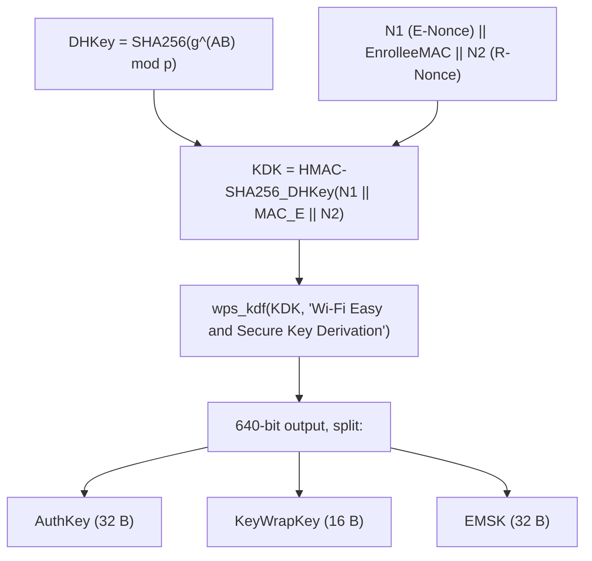

# Cryptography & Key Derivation

The WPS cryptography is implemented by the **vendored wpa_supplicant code** in
`wps/` and `crypto/`. Reaver does not reimplement it; it drives the registrar
side and (for Pixie Dust) taps the intermediate values. This document maps the
key-derivation chain to the source so you can follow what each Pixie value
([06-pixie-dust.md](06-pixie-dust.md)) actually is.

## 1. Diffie–Hellman exchange

Both sides exchange 192-byte DH public keys (RFC 3526 group 5, 1536-bit).

- The registrar (our) public key **PKR** is built in
  `wps_build_public_key()` (`wps_attr_build.c`). With normal keys it calls
  `dh5_init()` to generate a fresh keypair and zero-pads the pubkey to 192 bytes
  (`wps_attr_build.c:41-45`); the result is stored in `wps->dh_pubkey_r` and (for
  Pixie) exported as `pixie.pkr` (`wps_attr_build.c:62-69`).
- The enrollee (AP) public key **PKE** arrives in M1 and is stored in
  `wps->dh_pubkey_e`; for Pixie it is exported as `pixie.pke`
  (`wps_registrar.c:1918-1927`).
- **Small DH keys** (`-S`, `get_dh_small()`): a well-known Reaver/WPS speed trick
  that fixes the registrar's private key so the shared secret is cheap to
  compute. This both speeds up the online attack and changes how `pixiewps` is
  invoked (`-S` instead of `-r PKR`).

DH primitives: `crypto/dh_group5.c`, `crypto/dh_groups.c`, modular exponentiation
in `crypto/crypto_internal-modexp.c` and `tls/bignum.c`.

## 2. From DHKey to the session keys

After both public keys are known, `wps_derive_keys()` (`wps_common.c`) computes
the shared secret and derives the session keys.



Source `wps_common.c:110-137`:

```c
/* KDK = HMAC-SHA-256_DHKey(N1 || EnrolleeMAC || N2) */
hmac_sha256_vector(dhkey, sizeof(dhkey), 3, addr, len, kdk);
wps_kdf(kdk, NULL, 0, "Wi-Fi Easy and Secure Key Derivation", keys, sizeof(keys));
os_memcpy(wps->authkey,     keys, WPS_AUTHKEY_LEN);              /* 32 */
os_memcpy(wps->keywrapkey,  keys + WPS_AUTHKEY_LEN, WPS_KEYWRAPKEY_LEN); /* 16 */
os_memcpy(wps->emsk,        keys + 48, WPS_EMSK_LEN);            /* 32 */
```

- **AuthKey** authenticates WPS messages (HMAC authenticators) and is the value
  Pixie Dust needs — exported as `pixie.authkey` (`wps_common.c:133-137`).
- **KeyWrapKey** (AES) encrypts the "encrypted settings" (E-S1/E-S2, the WPA
  credentials) carried in M4/M6/M7.
- **EMSK** is the extended master session key (not used by the attack directly).

`wps_kdf()` is the WPS KDF built on HMAC-SHA-256 (`wps_common.c`); the underlying
primitive is `crypto/sha256.c` + `crypto/sha256-internal.c`.

## 3. PSK1 / PSK2 — proving the PIN halves

`wps_derive_psk()` (`wps_common.c:143`) splits the device password (the PIN) and
HMACs each half with the AuthKey:

```c
hmac_sha256(authkey, 32, dev_passwd, (len+1)/2, hash);  psk1 = hash[:16]
hmac_sha256(authkey, 32, dev_passwd + (len+1)/2, len/2, hash);  psk2 = hash[:16]
```

PSK1 covers the **first half** of the PIN, PSK2 the **second half**. These feed
the E-Hash/R-Hash commitments that make the two-halves oracle work
(see [05-pin-keyspace.md](05-pin-keyspace.md)):

- **E-Hash1/E-Hash2** (from the AP) are the enrollee's commitments; they are
  exported for Pixie at `wps_registrar.c:1763` / `:1783`.
- The registrar computes R-Hash1/R-Hash2 and reveals R-S1/R-S2 in M4/M6.
- A mismatch yields a NACK, which is exactly the per-half feedback Reaver relies
  on.

## 4. Encrypted settings & the recovered passphrase

Once the PIN is correct, M7 carries the AP's encrypted configuration (the WPA
PSK / passphrase). `wps_decrypt_encr_settings()` (`wps_common.c:163`) AES-CBC
decrypts it with the KeyWrapKey. The recovered network key ends up in
`wps->key` / `wps->essid`, which `reaver_main` prints on success
(`wpscrack.c:118-119`).

## 5. Registrar identity (`--win7`)

`initialize_wps_data()` (`init.c:40`) sets up the registrar `wps_data`. With
`-w`/`--win7` (`get_win7_compat()`), it populates device attributes to mimic a
Windows 7 registrar (`init.c:101-110`) using the constants from `defs.h:93-99`:

| Constant | Value |
|----------|-------|
| `WPS_DEVICE_NAME` | "Glau" |
| `WPS_MANUFACTURER` | "Microsoft" |
| `WPS_MODEL_NAME` | "Windows" |
| `WPS_MODEL_NUMBER` | "6.1.7601" |
| `WPS_DEVICE_TYPE` | `00 01 00 50 F2 04 00 01` |
| `WPS_OS_VERSION` | `01 00 06 00` |

The registrar UUID is randomized via `os_get_random()` (falling back to
`DEFAULT_UUID`) (`init.c:92`). The registrar is configured with
`disable_auto_conf = 1` so the AP does not generate a random PSK
(`init.c:66`).

## 6. The vendored crypto inventory

The build selects **internal** crypto backends (no OpenSSL/GnuTLS needed) via
`-DCONFIG_CRYPTO_INTERNAL` / `-DCONFIG_TLS_INTERNAL_*` (`Makefile:114-116`).
Compiled crypto objects (`Makefile:57`) include:

| Area | Files |
|------|-------|
| AES (CBC/CTR/EAX/OMAC1/wrap/unwrap + internal cipher) | `crypto/aes-*.c` |
| SHA-1 / SHA-256 (+ PBKDF2, TLS PRF) | `crypto/sha1*.c`, `crypto/sha256*.c` |
| MD4 / MD5 | `crypto/md4-internal.c`, `crypto/md5*.c` |
| DES, RC4 | `crypto/des-internal.c`, `crypto/rc4.c` |
| Diffie–Hellman group 5 | `crypto/dh_group5.c`, `crypto/dh_groups.c` |
| Big-number / modexp / RSA | `crypto/crypto_internal*.c`, `tls/bignum.c`, `tls/rsa.c` |
| FIPS PRF, Milenage, MS funcs | `crypto/fips_prf_internal.c`, `crypto/milenage.c`, `crypto/ms_funcs.c` |

Unused backends (`crypto_openssl.c`, `crypto_gnutls.c`, `tls_openssl.c`, …) are
present in the tree but **not** compiled by the Makefile.

> These files are vendored from wpa_supplicant and should not be hand-edited
> except for the documented Pixie hooks — see
> [11-vendored-code.md](11-vendored-code.md).
