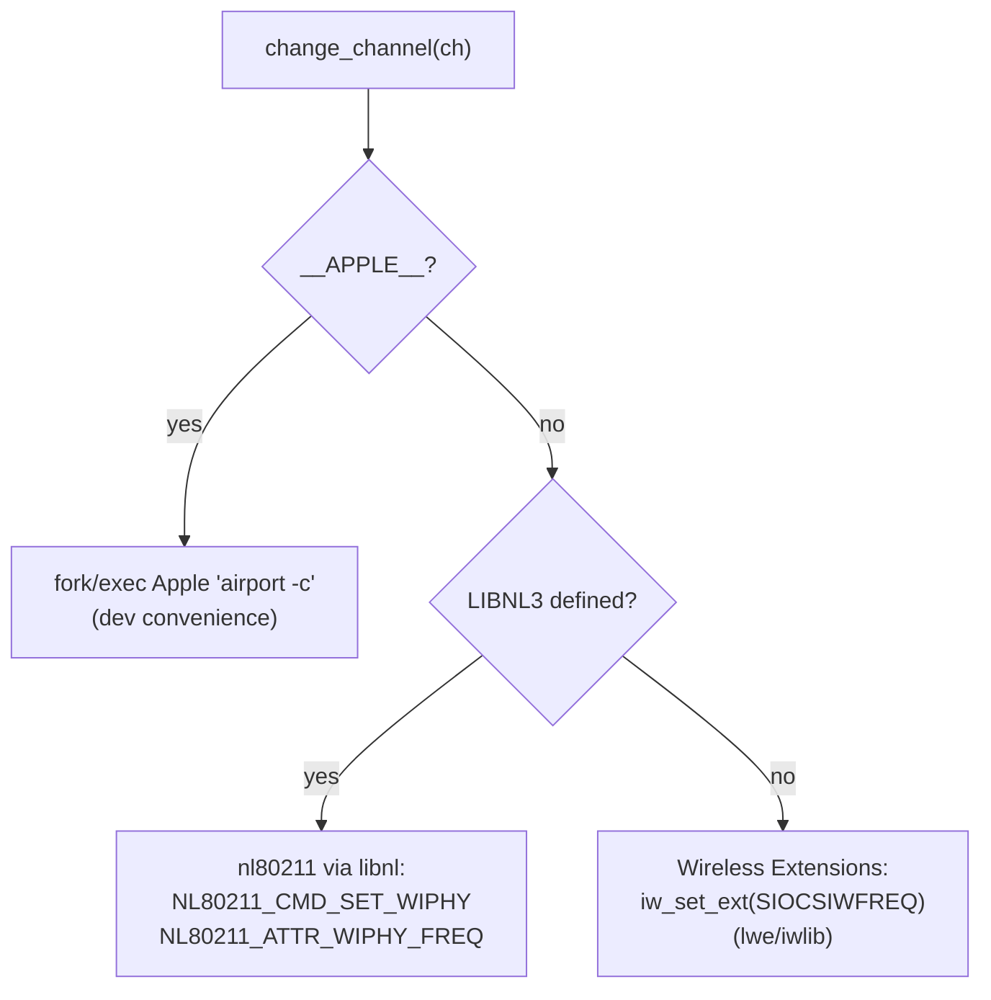

# Wireless Interface Management

This covers reading the interface MAC, capturing in monitor mode, and switching
802.11 channels — including the three build-time backends for channel switching.

Relevant files: `iface.c` (MAC + channel), `init.c` (`capture_init`),
`misc.c` (`pcap_sleep`).

## 1. Capture initialization

`capture_init()` (`init.c:119`) returns a pcap handle for either a file or a live
interface:

1. Try `pcap_open_offline()` first — if the source is a capture file, use it.
2. Otherwise `pcap_create()` + configure:
   - `pcap_set_snaplen(65536)`, `pcap_set_timeout(50)` ms,
     `pcap_set_promisc(1)` (`init.c:142-145`).
   - `pcap_set_rfmon()` — on Apple it forces monitor mode on; on Linux it leaves
     it off (the interface is expected to already be in monitor mode, e.g.
     `wlan0mon`).
   - `pcap_activate()`, with a fallback that retries without rfmon if the adapter
     reports `PCAP_ERROR_RFMON_NOTSUP` (`init.c:152`).
3. On unrecoverable failure it prints the pcap error and `exit(1)`
   (`init.c:171`).

The datalink type is later used by `has_rt_header()` (`80211.c:725`) to decide
whether radiotap headers are present (`DLT_IEEE802_11_RADIO`).

`pcap_sleep()` (`misc.c:105`) closes and reopens the handle around a `sleep()`,
so stale buffered packets are discarded during inter-attempt delays — important
for accurate per-pin timing.

## 2. Reading the interface MAC

`read_iface_mac()` populates `globule->mac`. Two implementations are selected at
compile time:

- **Linux** (`iface.c:74`): `ioctl(SIOCGIFHWADDR)` on a datagram socket.
- **FreeBSD / Apple** (`iface.c:53`): walk `getifaddrs()` for an `AF_LINK`
  address matching the interface name.

Reaver calls this when no `-m` MAC was supplied (`wpscrack.c:73`); wash always
calls it for an interface source (`wpsmon.c:278`).

## 3. Channel hopping order

`next_channel()` (`iface.c:116`) advances through a band-specific channel list,
wrapping around, but only when channel hopping is enabled
(`!get_fixed_channel()`):

| Band (`wifi_band`) | Channel list |
|--------------------|--------------|
| `BG_BAND` | 14, 1..13 (`BG_CHANNELS`, `iface.c:118`) |
| `AN_BAND` | 16, 34, 36, …, 196 (`AN_CHANNELS`, `iface.c:119`) |
| `BG_BAND\|AN_BAND` | both lists concatenated |

The band is chosen by `-5`/`--5ghz` (and `-2` in wash). The lists are indexed by
band using C99 designated initializers (`iface.c:125-134`).

Channel hopping is driven differently in the two programs:
- **reaver**: hops only when it cannot find the target's beacon within
  `BEACON_WAIT_TIME` (`read_ap_beacon()`, `80211.c:165`), then locks onto the
  AP's advertised channel (`change_channel`, `80211.c:178`).
- **wash**: a recurring `SIGALRM` timer calls `next_channel()` every
  `CHANNEL_INTERVAL` while scanning ([08-wash-scanner.md](08-wash-scanner.md)).

## 4. Channel switching backends

`change_channel()` has **three** implementations chosen by build configuration.
This is the single most important portability knob in the project.

| Backend | Condition | Mechanism | Source |
|---------|-----------|-----------|--------|
| Wireless Extensions (default) | neither `LIBNL3` nor `__APPLE__` | `iw_set_ext(skfd, iface, SIOCSIWFREQ, &wrq)` using Wireless Tools (`lwe/`) | `iface.c:220` |
| nl80211 / libnl | `-DLIBNL3` (from `--enable-libnl3` or `--enable-libnl-tiny`) | Build an nl80211 `SET_WIPHY` message with the target frequency and send it via a generic netlink socket | `iface.c:182` |
| Apple airport | `__APPLE__` | `fork`/`execve` the private `airport` binary with `-c<channel>` | `iface.c:153` |

> **Why this matters:** the default wext backend silently fails on kernels
> without Wireless Extensions support (common on modern distros). In that case
> `change_channel()` does nothing and the `-c`/channel-hopping options appear to
> no-op. Building with `--enable-libnl3` (or `--enable-libnl-tiny`) switches to
> nl80211, which works on modern kernels. See
> [02-build-system.md](02-build-system.md).

Frequency conversion:
- wext path converts a channel to a frequency with `iw_float2freq()`
  (Wireless Tools).
- libnl path uses `ieee80211_channel_to_frequency()` (`iface.c:172`, borrowed
  from aircrack-ng): `2407 + chan*5` for 2.4 GHz, `2484` for channel 14, else
  `(chan + 1000) * 5`.

On success the wext and Apple paths call `set_channel()` to record the current
channel; the libnl path sets it implicitly via the surrounding logic.

## 5. The `lwe/` directory (Wireless Tools)

`lwe/` is a vendored copy of **Wireless Tools v29** (`iwlib`). Only
`lwe/iwlib.o` is compiled (`Makefile:37`). The Makefile reads `WT_VERSION` and
`WE_VERSION` from `lwe/iwlib.h` to copy the matching `lwe/wireless.<ver>.h` to
the generated `lwe/wireless.h` (`Makefile:103-107`, `Makefile:134`). This keeps
the Wireless-Extensions header in sync with the toolset version. Details in
[11-vendored-code.md](11-vendored-code.md).

## 6. Related flags

| Flag | Program | Effect |
|------|---------|--------|
| `-c, --channel` | both | Pin to a channel; implies fixed channel (no hopping). |
| `-f, --fixed` | reaver | Disable channel hopping. |
| `-5, --5ghz` | both | Use the A/N (5 GHz) band. |
| `-2, --2ghz` | wash | Use the B/G (2.4 GHz) band. |
| `-i, --interface` | both | Interface name (must be monitor-capable). |
| `-m, --mac` | reaver | Override the source MAC (else read from the interface). |
| `-M, --mac-changer` | reaver | Vary the last MAC bytes each attempt (`set_next_mac`, `cracker.c:72`). |
