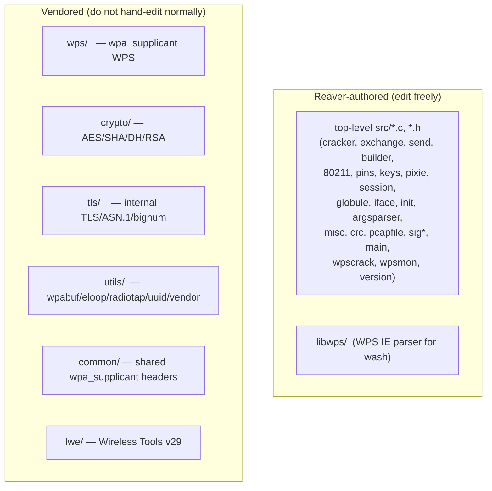

# Vendored Code

A large fraction of `src/` is **third-party code copied in** ("vendored"), not
written for Reaver. Knowing which trees are vendored — and the few places Reaver
patches them — is essential before making changes.

## 1. What is vendored vs authored

| Tree | Origin | Used for |
|------|--------|----------|
| `wps/` | wpa_supplicant | The WPS protocol state machine (registrar/enrollee, attribute build/parse/process). |
| `crypto/` | wpa_supplicant | AES, SHA-1/256, MD4/5, DES, RC4, DH group 5, internal big-number/RSA, FIPS PRF. |
| `tls/` | wpa_supplicant | Internal TLS 1.x, ASN.1, PKCS, RSA, X.509 (selected by `-DCONFIG_*_INTERNAL`). |
| `utils/` | wpa_supplicant | `wpabuf`, `eloop`, radiotap parser, `uuid`, OS abstraction, plus Reaver's `vendor.c`. |
| `common/` | wpa_supplicant | Shared definitions/helpers included by the above. |
| `lwe/` | Wireless Tools v29 | `iwlib` for wext channel switching. |

> Per `AGENTS.md`: these trees should **not** be hand-edited normally. The
> compiled subset is whatever the `Makefile` lists in `UTILS_OBJS`, `WPS_OBJS`,
> `TLS_OBJS`, `CRYPTO_OBJS`, `LWE_OBJS` — many files in these directories
> (alternative crypto/TLS backends, Windows eloop, etc.) are present but never
> compiled.

## 2. The Reaver patches to `wps/`

The one place the vendored WPS code is intentionally modified is the **Pixie
Dust data-collection hooks**. Each hook is guarded by `if (pixie.do_pixie)` so a
normal build/run is unaffected. All of them include `pixie.h` and use
`pixie_format()` + `PIXIE_SET` ([06-pixie-dust.md](06-pixie-dust.md)).

| File | Line | Hook |
|------|------|------|
| `wps/wps_attr_build.c` | `:23` include, `:65` | Export registrar DH pubkey → `pixie.pkr`. |
| `wps/wps_common.c` | `:26` include, `:133` | Export AuthKey after key derivation → `pixie.authkey`. |
| `wps/wps_registrar.c` | `:28` include | (multiple hooks below) |
| `wps/wps_registrar.c` | `:1699` | Enrollee nonce → `pixie.enonce`. |
| `wps/wps_registrar.c` | `:1763` | E-Hash1 → `pixie.ehash1`. |
| `wps/wps_registrar.c` | `:1783` | E-Hash2 → `pixie.ehash2`, then call `pixie_attack()`. |
| `wps/wps_registrar.c` | `:1923` | Enrollee DH pubkey → `pixie.pke`. |

Other Reaver-relevant behavior of the vendored WPS code (called from the
authored layer):
- `wps_registrar_process_msg()` / `wps_registrar_get_msg()` — process an incoming
  WPS message and produce the next one (driven by `exchange.c` / `send.c`).
- `wps_registrar_add_pin()` / `wps_registrar_invalidate_pin()` — register/clear
  the candidate PIN each attempt (`pins.c:71`, `pins.c:79`).
- `wps_init()` / `wps_deinit()` / `wps_registrar_init()` — lifecycle of the
  `wps_data` structure (`init.c`).

## 3. `utils/` highlights

| File | Role |
|------|------|
| `utils/wpabuf.c` | Growable buffer type used throughout the WPS code (`wpabuf_alloc_copy`, `wpabuf_head`, …). |
| `utils/radiotap.c` + `radiotap_iter.h` | Radiotap field iterator used by `80211.c` to read channel/signal/flags. |
| `utils/uuid.c` | UUID generation for the registrar identity. |
| `utils/vendor.c` | **Reaver-authored** OUI→chipset name table (`get_vendor_string`). |
| `utils/eloop.c` | wpa_supplicant event loop (linked; Reaver uses its own loops). |
| `utils/common.c` | `hex2str`/byte-order/`WPA_GET_BE16` style helpers and `sanitize_string`. |
| `utils/os_unix.c` | OS abstraction (`os_get_random`, `os_memcpy`, …). |
| `utils/endianness.h` | The `end_*` byte-order macros used by authored code. |

## 4. Crypto/TLS backend selection

The Makefile compiles only the **internal** implementations and defines the
macros that select them (`Makefile:114-116`):

- `-DCONFIG_CRYPTO_INTERNAL` — use `crypto_internal*.c` instead of
  OpenSSL/GnuTLS/NSS.
- `-DCONFIG_TLS_INTERNAL_CLIENT` / `-DCONFIG_TLS_INTERNAL_SERVER` — use the
  bundled `tls/` instead of an external TLS library.
- `-DCONFIG_INTERNAL_LIBTOMMATH` — use the bundled big-number math.

Therefore files like `crypto/crypto_openssl.c`, `crypto/tls_gnutls.c`,
`tls_nss.c`, etc. exist in the tree but are **not** built. This is why Reaver has
no OpenSSL/GnuTLS link dependency despite containing references to them.

## 5. `lwe/` (Wireless Tools)

`lwe/` is Wireless Tools v29. The build:
- Compiles only `lwe/iwlib.o` (`Makefile:37`).
- Picks the Wireless-Extensions header matching `iwlib.h`'s `WE_VERSION` and
  copies it to the generated `lwe/wireless.h` (`Makefile:103-107`,
  `Makefile:134`).

It is only relevant on the default (wext) channel-switching path
([10-wireless-interface.md](10-wireless-interface.md)); with
`--enable-libnl3`/`--enable-libnl-tiny` the nl80211 path is used instead.

## 6. Practical guidance

- **Bug in protocol/crypto behavior?** First check whether the file is vendored.
  If so, prefer fixing it in the authored layer (e.g. how `exchange.c` drives the
  state machine) rather than diverging from upstream wpa_supplicant.
- **Adding a new collected value for Pixie?** Follow the existing pattern: add a
  guarded `if (pixie.do_pixie) { pixie_format(...); PIXIE_SET(...); }` block at
  the point the value becomes available, and a field in `struct pixie`
  (`pixie.h`).
- **Updating Wireless Tools / wpa_supplicant?** Re-vendor the tree wholesale and
  re-apply the small pixie hooks; do not cherry-pick edits into the existing
  copy.
